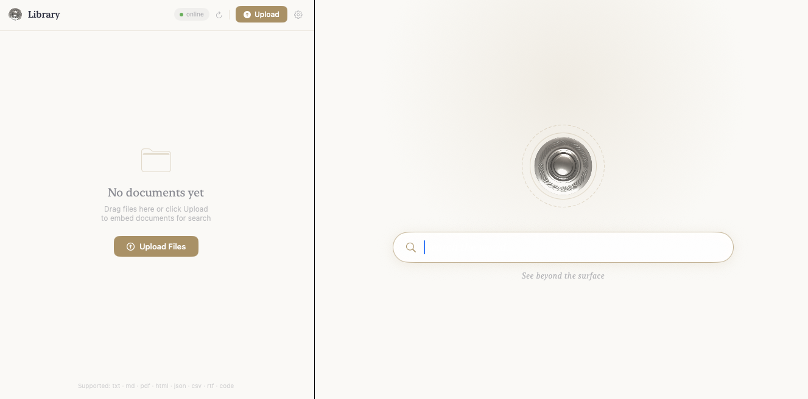

# Totem

<p align="center">
  <a href="Demo/README.md">
    
  </a>
</p>

Totem is a distributed vector search node for [Seer](https://github.com/rao-studios/Seer). In standalone mode it exposes HTTP routes for direct use. In distributed mode it connects to a Seer mothership over gRPC, registers itself, and serves all search and index traffic through a persistent bidirectional session stream.

## Seer

[Seer](https://github.com/rao-studios/Seer) is the mothership server that coordinates a fleet of Totem nodes. It handles authentication (via Supabase), conversation and RAG pipelines, sentiment analysis (Sinatra), royalty tracking (Gita), and personalization (Marielle). When a user issues a search or index request through Seer, Seer fans the operation out to all registered Totem nodes in parallel and merges the results.

Totem owns no user sessions and no authentication — that is Seer's responsibility. Totem's sole job is fast, reliable vector storage and nearest-neighbor search.

## Prerequisites

- Swift 6.0+ / Xcode 15+
- macOS 15+
- A [Mistral API key](https://console.mistral.ai/) or Apple Silicon

## Setup

```bash
export MISTRAL_API_KEY="your-key-here"
```

### MLX (on-device)

No API key needed. Download the model from the Hub before starting the server:

```bash
pip install huggingface_hub
hf auth login
hf download mlx-community/Qwen3-Embedding-0.6B-4bit-DWQ
```

The model is cached in `~/.cache/huggingface/hub/` and loaded on first request when `--use-mlx` is set.

**Apple Silicon** — standard `swift build -c release` picks up MLX automatically.

**Linux / NVIDIA GPU** — requires CUDA 12.x, the cuDNN Frontend headers, and LAPACK. Build with:

```bash
export PATH=/usr/local/cuda/bin:${PATH}
export LD_LIBRARY_PATH=/usr/local/cuda/lib64:${LD_LIBRARY_PATH:-}
export CUDA_ARCH=sm_86   # match your GPU compute capability
SPM_CUDA=1 swift build -c release --jobs 2
```

The package is pinned to `riteshpakala/mlx-swift:gab/cuda1` which carries patches for CUDA 12.9 + GCC 13 half-precision math ambiguity, CUTLASS-free builds, and cuDNN Frontend include paths. See [Docs/MLX-CUDA-Linux.md](Docs/MLX-CUDA-Linux.md) for the full setup guide, dependency list, and patch notes.

## Build & Run

```bash
cd /path/to/Totem
swift build -c release

# Standalone — HTTP only, no Seer required
.build/release/totem --host 127.0.0.1 --port 8080

# On-device MLX (Apple Silicon)
.build/release/totem --host 127.0.0.1 --port 8080 --use-mlx

# Distributed — registers with a running Seer instance
.build/release/totem \
  --host 127.0.0.1 --port 8080 \
  --grpc-port 9090 \
  --mothership-host 127.0.0.1 \
  --mothership-grpc-port 50051
```

Or during development:

```bash
swift run totem --host 127.0.0.1 --port 8080
swift run totem --host 127.0.0.1 --port 8080 --use-mlx
```

Check health:

```bash
curl http://127.0.0.1:8080/health
# {"status":"ok"}
```

### CLI flags

| Flag | Default | Description |
|---|---|---|
| `--host` | `127.0.0.1` | HTTP bind address |
| `--port` | `8080` | HTTP port |
| `--grpc-port` | `9090` | gRPC listen port (distributed mode) |
| `--mothership-host` | _(none)_ | Seer host — omit for standalone mode |
| `--mothership-grpc-port` | _(none)_ | Seer gRPC port |
| `--use-mlx` | `false` | Use on-device MLX embeddings |
| `--mlx-model` | `Qwen3-Embedding-0.6B-4bit-DWQ` | Hub model ID for MLX |

---

## Architecture

```
┌───────────────────────────────────────────────────────┐
│  Seer (Mothership)                                    │
│  ┌──────────────┐  Fan-out: Search / Index /          │
│  │ TotemQuery   │  Remove / Library / HNSW ───────────┼──┐
│  │ Client       │                                     │  │
│  └──────┬───────┘                                     │  │
│         │  gRPC bidirectional Session stream          │  │
└─────────┼─────────────────────────────────────────────┘  │
          │  (Totem holds the connection)                  │
          ▼                                                │
┌───────────────────────────────────────────────────────┐  │
│  Totem (this repo)                                    │  │
│  MothershipRegistrationClient                         │  │
│    1. register()         — sends host/grpc/httpPort   │  │
│    2. session()          — bidirectional stream       │  │
│       • pings Seer every 30 s                         │  │
│       • receives requests, dispatches via             │  │
│         MothershipRequestDispatcher                   │  │
│    3. updateAvailability() — signals storage capacity │  │
│                                                       │  │
│  gRPC Services (also reachable directly):             │◀─┘
│    TotemQuery   — search / index / remove             │
│    TotemLibrary — library (paginated groups)          │
│    TotemHNSW    — stats / graph / node ops            │
│                                                       │
│  Database (actor)                                     │
│    RegistryMutator  ←─ RegistryWAL                    │
│    TableMutator     ←─ HNSWTopologyWAL                │
│      PartitionTable (multi-shard)                     │
│        HNSWShard × N  ──▶  PartitionIndex             │
│          HNSWGraph    ──▶  HNSWVectorStore (mmap)     │
│          PartitionQuantizer (PQ codebooks)            │
└───────────────────────────────────────────────────────┘
```

### Registration & session lifecycle

When `--mothership-host` is provided, `MothershipRegistrationClient` starts a persistent loop:

1. **`register` RPC** — Totem sends its UUID, HTTP host, gRPC port, and HTTP port. Seer records the node and returns an acceptance signal. Totem retries every 5 s until accepted.
2. **`session` RPC** — Totem opens a bidirectional stream and holds it. Totem sends periodic pings every 30 s. Seer sends request payloads (search, index, remove, library, HNSW ops) over the same stream. `MothershipRequestDispatcher` routes each message to the correct service impl and writes the response back with a matching `correlationID`.
3. **`updateAvailability` RPC** — A one-shot call Totem makes when its storage capacity changes (e.g. after a large batch completes). Seer uses this to steer new index requests to nodes that are accepting storage.

If the session drops, `MothershipRegistrationClient` sleeps 5 s and reconnects automatically.

---

## gRPC Services

All services run on `--grpc-port` (default 9090) and are also reachable via the Seer session stream.

### TotemQuery

| RPC | Request | Response | Description |
|---|---|---|---|
| `Search` | `TotemSearchRequest` | `TotemSearchResponse` | HNSW nearest-neighbor search. Accepts raw `query_text` (Totem embeds it) or a precomputed `query_embedding`. |
| `Index` | `TotemIndexRequest` | `TotemIndexResponse` | Embed and index a batch of documents. Returns immediately; async write queue drains in the background. |
| `Remove` | `TotemRemoveRequest` | `TotemRemoveResponse` | Remove specific document IDs, or all documents for an owner when `document_ids` is empty. |

### TotemLibrary

| RPC | Request | Response | Description |
|---|---|---|---|
| `Library` | `TotemLibraryRequest` | `TotemLibraryResponse` | Paginated list of groups for an owner. `after_id` is a cursor; `limit` controls page size. |

### TotemHNSW

| RPC | Request | Response | Description |
|---|---|---|---|
| `Stats` | `TotemHNSWStatsRequest` | `TotemHNSWStatsResponse` | Per-owner or per-document HNSW stats (live nodes, max level, trained status, shard count). |
| `Graph` | `TotemHNSWGraphRequest` | `TotemHNSWGraphResponse` | Return graph nodes filtered by scope (`personal`, `global`, `documents`), shard index, or document IDs. |
| `NodeBatch` | `TotemHNSWNodeBatchRequest` | `TotemHNSWNodeBatchResponse` | Bulk lookup of nodes by partition ID. |
| `Node` | `TotemHNSWNodeRequest` | `TotemHNSWNodeResponse` | Single partition lookup with full text and all neighbor layers. |
| `DeleteNode` | `TotemHNSWDeleteNodeRequest` | `TotemHNSWDeleteNodeResponse` | Soft-delete a partition from the graph. |

### Session message envelope

Every payload traveling over the `Session` stream is wrapped in `TotemSessionMessage`:

```protobuf
message TotemSessionMessage {
  string correlation_id = 1;   // ties each request to its response
  string totem_id       = 2;   // set by Totem so Seer can identify the stream

  oneof payload {
    TotemSessionPing            ping                     = 3;
    TotemSessionPong            pong                     = 4;
    TotemSearchRequest          search_request           = 5;
    TotemSearchResponse         search_response          = 6;
    TotemIndexRequest           index_request            = 7;
    TotemIndexResponse          index_response           = 8;
    TotemRemoveRequest          remove_request           = 9;
    TotemRemoveResponse         remove_response          = 10;
    TotemLibraryRequest         library_request          = 11;
    TotemLibraryResponse        library_response         = 12;
    TotemHNSWStatsRequest       hnsw_stats_request       = 13;
    TotemHNSWStatsResponse      hnsw_stats_response      = 14;
    TotemHNSWGraphRequest       hnsw_graph_request       = 15;
    TotemHNSWGraphResponse      hnsw_graph_response      = 16;
    TotemHNSWNodeBatchRequest   hnsw_node_batch_request  = 17;
    TotemHNSWNodeBatchResponse  hnsw_node_batch_response = 18;
    TotemHNSWNodeRequest        hnsw_node_request        = 19;
    TotemHNSWNodeResponse       hnsw_node_response       = 20;
    TotemHNSWDeleteNodeRequest  hnsw_delete_node_request = 21;
    TotemHNSWDeleteNodeResponse hnsw_delete_node_response = 22;
  }
}
```

`MothershipRequestDispatcher` reads the `payload` oneof, calls the matching service impl, and returns a response message with the same `correlation_id`.

---

## Core Services

### Registry

The `TotemRegistry` is the ownership and access-control layer. Every document must be registered to an owner before it can be searched.

| Concept | What it is |
|---|---|
| `ownerId` | Arbitrary string identifying the caller — passed in the request body (no auth middleware) |
| `DocumentID` | SHA-256 hash of the document's text chunks — content-addressed, collision-safe |
| `GroupID` | Owner-defined namespace that bundles documents together |
| `Access` | `.available` (globally searchable) or `.restricted` (owner-only, default) |

Documents are **deduplicated by content**: if two owners embed the same text, only one copy of the vectors is stored. The second owner is linked to the existing document automatically.

### Groups

Groups are logical collections owned by a single owner. Documents inside a group share metadata (tags, description) that surfaces in search. Access on the group propagates to all documents inside it.

```json
"group": {
  "id": "my-group",
  "label": "My Knowledge Base",
  "owner_id": "alice",
  "documents": [],
  "access": "restricted",
  "metadata": {
    "description": "Internal docs",
    "tags": ["swift", "server"]
  }
}
```

### Partition Table & HNSW

Each document is split into text chunks (partitions). Each partition gets a 1024-dimensional embedding. Partitions live in:

- **PartitionIndex** — per-document index holding PQ-compressed vectors, a tags embedding, learned codebooks, and an optional metadata blob.
- **PartitionTable** — multi-shard container holding all document indices plus the HNSW proximity graph shards.
- **HNSWShard / HNSWGraph** — approximate nearest-neighbor graph; each shard handles a slice of the embedding space.
- **HNSWVectorStore** — memory-mapped binary file for raw float32 embeddings.

A new shard is spawned automatically when the active shard crosses the configured node-count threshold.

### Product Quantization (PQ)

Embeddings are compressed at index time via `PartitionQuantizer`. Each 1024-float vector is encoded into a compact `UInt16` code sequence using learned k-means codebooks. Search uses Asymmetric Distance Computation (ADC) against pre-computed distance tables — fast enough to scan millions of partitions without loading full vectors.

Codebook size scales dynamically with the training corpus (`scaledCodebookSize`): a document with 3 partitions uses k=2; a large shared index may grow to k=2048 or higher. An `adaptiveThreshold` is calibrated per-document from reconstruction errors during training and overrides the static per-codec fallback at search time.

If all partitions in a batch fail embedding (e.g. empty text), Totem skips index creation for that document and logs a warning rather than crashing.

### WAL Persistence

Two write-ahead logs survive restarts:

- **HNSWTopologyWAL** — append-only log of graph topology mutations (node insertions, edge updates).
- **RegistryWAL** — append-only log of registry mutations (register, linkOwner, updateAccess, earnings).

On startup, both logs are replayed before any requests are served. Nodes present in the WAL but missing a matching `PartitionIndex` are tombstoned by `markIndicesReady` to prevent stale data from surfacing in search.

### EmbeddingModelProvider

Two backends, selected at startup with `--use-mlx`:

| Backend | Flag | Model | Dimensions |
|---|---|---|---|
| Mistral API (default) | _(none)_ | `mistral-embed` | 1024 |
| On-device MLX | `--use-mlx` | `Qwen3-Embedding-0.6B-4bit-DWQ` (default) | 1024 |

**Mistral** — Actor-based API client. Max 3 concurrent slots with a priority queue; identical texts within a batch are coalesced into one request. Requires `MISTRAL_API_KEY`.

**MLX** — Runs entirely on-device via Apple Silicon GPU. Model is loaded from the Hugging Face Hub cache on first request. No API key or network access needed after download. Use `--mlx-model` to specify a different Hub model ID.

---

## HTTP Routes

The HTTP routes are the **standalone path**. In distributed mode all production traffic flows through the gRPC session stream; the HTTP routes remain available for direct use and debugging.

### `POST /v1/batch/embeddings`

Indexes one or more documents. Each document's text is embedded, compressed, and added to the HNSW graph. The response is returned immediately — indexing happens in a detached background task.

**Request**

```json
{
  "inputs": [
    "A string, or...",
    ["array", "of", "strings"]
  ],
  "sanitize": true,
  "seer": {
    "owner_id": "alice",
    "group": {
      "id": "my-group",
      "label": "My Knowledge Base",
      "owner_id": "alice",
      "documents": []
    }
  },
  "tags": [
    ["optional", "per-document", "tags"],
    ["second-doc-tags"]
  ],
  "media_type": "text"
}
```

| Field | Type | Required | Description |
|---|---|---|---|
| `inputs` | `[String \| [String]]` | Yes | One entry per document. String or array of strings. |
| `seer.owner_id` | String | Yes | Identity of the caller. Lowercased on receipt. |
| `seer.group` | Group | No | Assigns all documents in this batch to a named group. |
| `sanitize` | Bool | No | When `true`, passes each input through `TextChunker` before embedding. Default: `false`. |
| `tags` | `[[String]]` | No | Per-document tag hints. Outer index aligns 1:1 with `inputs`. Auto-generated if empty. |
| `media_type` | String | No | `"text"` (default) or `"image"`. |

**Response**

```json
{
  "object": "list",
  "model": "mistral-embed",
  "usage": { "prompt_tokens": 312, "total_tokens": 312 },
  "success": true,
  "user": { ... }
}
```

---

### `POST /v1/search`

Searches indexed documents for the closest matching partitions to a query string.

**Request**

```json
{
  "query": "how does product quantization work?",
  "seer": {
    "owner_id": "alice",
    "group": { "id": "my-group", "label": "...", "owner_id": "alice", "documents": [] },
    "scope": "personal",
    "aggregate": false
  }
}
```

| Field | Type | Required | Description |
|---|---|---|---|
| `query` | String | Yes | Natural language query. Embedded at search time. |
| `seer.owner_id` | String | Yes | Scopes the search to this owner's documents by default. |
| `seer.scope` | `"personal" \| "global"` | No | `personal` (default): only the owner's documents. `global`: all `.available` documents. |
| `seer.aggregate` | Bool | No | When `true`, also searches groups the owner has access to. |
| `seer.group` | Group | No | Restricts search to a specific group. |
| `seer.groups` | [Group] | No | Restricts search to a list of groups. |
| `seer.tags` | [String] | No | Tag filter: only documents whose tag embedding is within threshold are considered. |

**Response**

```json
{
  "object": "list",
  "texts": ["...most relevant partition text...", "...second result..."],
  "references": [
    { "document_id": "abc123", "partition_id": "def456", "distance": 0.12 }
  ]
}
```

`texts` and `references` are parallel arrays.

---

## Workflow Example

### 1 — Embed documents

```bash
curl -X POST http://127.0.0.1:8080/v1/batch/embeddings \
  -H "Content-Type: application/json" \
  -d '{
    "inputs": [
      "Swift actors serialize concurrent access by routing all calls through a single executor.",
      "Product quantization compresses high-dimensional vectors into compact integer codes."
    ],
    "seer": {
      "owner_id": "alice",
      "group": {
        "id": "swift-docs",
        "label": "Swift Documentation",
        "owner_id": "alice",
        "documents": []
      }
    }
  }'
```

### 2 — Search

```bash
curl -X POST http://127.0.0.1:8080/v1/search \
  -H "Content-Type: application/json" \
  -d '{
    "query": "how do actors work in Swift?",
    "seer": {
      "owner_id": "alice",
      "scope": "personal"
    }
  }'
```

### 3 — Share documents publicly (optional)

Documents are `.restricted` by default. To make a document globally searchable, set the group's `"access": "available"`:

```json
"group": {
  "id": "public-docs",
  "label": "Public Documentation",
  "owner_id": "alice",
  "documents": [],
  "access": "available"
}
```

Another owner can then find it with `"scope": "global"`.

---

## Notes

- **No authentication.** `owner_id` is taken directly from the request body. Use a reverse proxy (nginx, Caddy) with bearer token enforcement if you expose this to the internet.
- **Persistence.** The registry and HNSW topology are persisted via WAL files in the process working directory. Do not delete these while the server is running.
- **Deduplication.** Document IDs are SHA-256 hashes of their content. Submitting the same text twice under a different owner links the second owner to the existing vectors — no re-embedding occurs.
- **Tag auto-generation.** If no `tags` are supplied, `TagGenerator` derives frequency-weighted keywords from the text. These are embedded separately and used as a pre-filter during search.
- **Distributed mode.** In distributed mode all fan-out goes through the gRPC session stream. The HTTP routes remain available for direct use and debugging. Multiple Totem nodes can run simultaneously; Seer fans search queries to all active nodes in parallel and merges results.

---

## Skills

Detailed internals and operational docs live in [`Skills/`](Skills/SKILLS.md):

| Skill | Contents |
|---|---|
| [Database](Skills/Database/README.md) | PartitionTable, HNSW, PQ, Registry, WAL, search and index flows |
| [GRPC](Skills/GRPC/README.md) | Service impls, session stream, mothership registration, dispatcher |
| [Providers](Skills/Providers/README.md) | Mistral API provider, on-device MLX provider |
| [Concurrency](Skills/Concurrency/README.md) | Database actor, RegistryMutator, TableMutator, caching primitives |
| [Persistence](Skills/Persistence/README.md) | HNSWTopologyWAL, RegistryWAL, HNSWVectorStore (mmap), replay order |
| [API](Skills/API/README.md) | HTTP routes in standalone mode, request/response shapes |

## Docs

Setup and operational guides:

| Guide | Contents |
|---|---|
| [MLX on Linux / CUDA](Docs/MLX-CUDA-Linux.md) | Full CUDA build setup on Ubuntu 24.04 — dependencies, fork patches, CUDA arch selection, troubleshooting |
